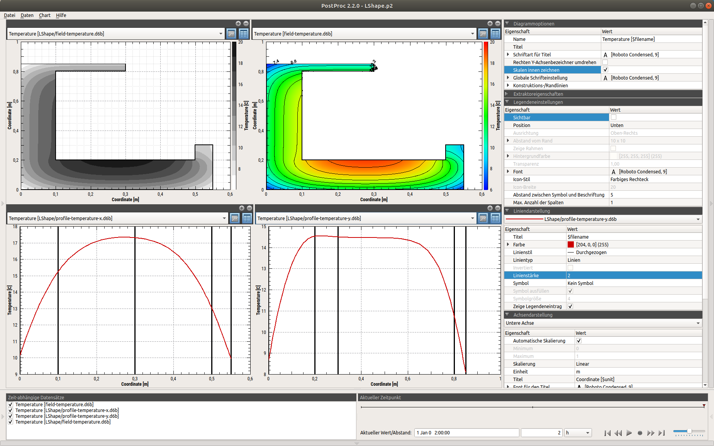
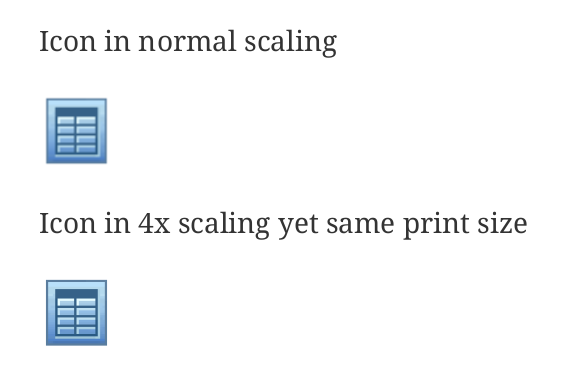

# asciidoctor-publishing
Python scripts to assist with publishing Asciidoctor based documents using customized html and pdf outputs


## Overview

[Asciidoctor](https://asciidoctor.org) is an awesome publishing system, especially for technical documentation. It generates nice html-output and together with [asciidoctor-pdf](https://asciidoctor.org/docs/asciidoctor-pdf) also very nice pdf output.

Setting up the tool chain may be a bit tricky, so I summarized the steps to install it below (mostly for my own reference). Of course, (other) instructions can be found anywhere in the net.

When creating manuals/documentation text that target html and pdf output alike, some things need to be handled that are tricky to do with AsciiDoctor itself. This mostly involves image and equation handling (in case math is involved).
Also, cross-referencing isn't easy to do with multi-document texts and even the good editors like AsciiDocFX do not (yet) have the checking features, that I need. 

In the sections below you find a quick explanation of how the scripts in this repository may help you with your AsciiDoctor publishing.
(at least they prove useful for my documentation work :-).


### Image-related handling pdf and html output

With newer versions of asciidoctor-pdf, the style configuration is already very good (see example in this repository). However, there are some things that need to be handled differently in pdf-output and html-output. 
This mostly applies to image handling.

When viewing the html-documentation on the screen, most viewers will have a FullHD resolution and a content area with of about 700..800 px. Screenshots/images/pictures that are larger than this width will be automatically 
resized to fit the content width. This may be problematic for two reasons:

- the resizing algorithm in the web browser is usually not as good as in image processing software (see (Gimp)[https://www.gimp.org] an similar)
- sometimes, the image should not span the entire width for layouting purposes (but rather 80%). While this can be configured in the asciidoctor `image::` tag, still the webbrowser-based resizing may be problematic. See for yourself in 
the following examples

Original image resized in webbrowser:



Image after being manually resized in graphics software:


Obviously, the quality is better in the second variant. However, for the PDF output (with a much higher print resoultion and zoom-in feature), you would like to keep the original resolution.

Also, for certain screenshots you may want to have crisp pixel-clear images in printed PDFs. Think of printing a 1000px screenshot on a 1200 dpi printer. Here, the image resolution won't be enough so 
the image is smoothened out. In order to get pixel shown in print output as well, you need to insert a scaled image, yet scaled without interpolating pixels but just enlarging those.

You can achieve this effect, for example, in any graphics software like Gimp (scale, Interpolation: _None_). The result becomes visible when reading the PDF, on-screen and printed:



Generated PDF: [iconNormal_scaled_comparison.pdf](./example/images/diagram_examples/iconNormal_scaled_comparison.pdf)


**Bottom line**: You may need two different image files, one for html and one for PDF output. But obviously, you do not want to write two versions of your (possibly large) adoc files, right?

### Script functionality

The Python-script in this repository (see subdirectory scripts) does the following:

- scan all adoc files (in the directory passed as argument) for `image::` tags
- extract file names and look up file names (either by absolute path or relative to the path given in `:imagesdir:` property)
- if the referenced file is missing, it prints out a detailed error message that helps to track down the error:

```
    # error line syntax
    <adocfile.adoc>:<line>: image file <path/to/image.png> (</full/path/to/image/file>) not found/accessible
    # example
    main.adoc:137: image file 'diagram_examples/multichart_view_de-print.png' ('./examples/images/diagram_examples/multichart_view_de-print.png') not found/accessible
```

The second path in paranthesis is the actual search path, including the resolved `:imagesdir:` property.

- then, if the file was found, it looks if a file with `-print` suffix is found besides the referenced image file; if the referenced file contains a `-print` suffix, it looks for the file variant without suffix
- depending on the generation mode (argument to the python script), it now replaces the file reference with the respective version with or without `-print` suffix


#### Example

Suppose, a file `main.adoc` has an image reference:

`image::foo.png[pdfwidth=8cm]`

Now you run the script:

```bash
# put all adoc files in current directory into 'pdf' mode
> python adoc-image-prep.py pdf .
```

and the image reference will have changed to

`image::foo-print.png[pdfwidth=8cm]`

Now you run the script again with:

```bash
# put all adoc files in current directory into 'html' mode
> python adoc-image-prep.py html .
```

and the image reference will have changed again to

`image::foo.png[pdfwidth=8cm]`

so, basically this toggles in-place the file names to the image files.

After each execution of `adoc-image-prep.py` you can run `asciidoctor` or `asciidoctor-pdf` as usual.

#### Generating html and pdf output example

See directory `example`, it contains two adoc-files with image references, a subdirectory with image files and a bash script `build.sh`.
Run this script to generate first html output and afterwards pdf output, hereby using different image files for each generation process.

Take a look at the `build.sh` script to see how the python script is called.

### Link/Cross-Referencing help

When you use cross-referencing, e.g. place `[[link_label]]` in your adco files somewhere and later refer to it with a link `<<link_label, section xxx>>`, you often have to deal with a couple of issues:

1. Which labels did I place in my many files and what were the names exactly?
2. Did I spell that label correctly, and if not, where in the text was the bad cross-reference?
3. Did I use a correct link label name?
4. Did I accidentally use the same link label name twice?

Especially (2) is tricky - if you simply mispell a link label, the generated text will contain a link/URL as desired, but clicking on it does nothing. Also, (4) is pretty bad - you may think everything is find, but when you actually click on the click you jump off to some different place in the text.

Here, you can use the script `adoc-link-check.py`. It scans a directory for all `adoc` files and does two things:

- get a print a list of all link labels found in the texts with their locations and section titles/image file paths etc. found on the following line of the label
- print out errors in case if duplicates or malformed/empty link labels
- prints out errors of missing/misspelled cross-references with their locations

Example:

```bash
# check all adoc files in current directory for correct link labels and cross references
> python adoc-link-check.py .
```


## Installation/tool chain setup for Asciidoctor

This is just a note-to-self, may work for you as well. Otherwise see the asciidoctor webpage for infos.

### Linux/Ubuntu

```bash
> sudo apt install asciidoctor 

# Install ruby, and then:

> sudo gem install asciidoctor-pdf --pre
> sudo gem install rouge

# Install rouge syntax highlighter extension
> sudo gem install asciidoctor-rouge
> sudo gem install asciidoctor-mathematical
```


